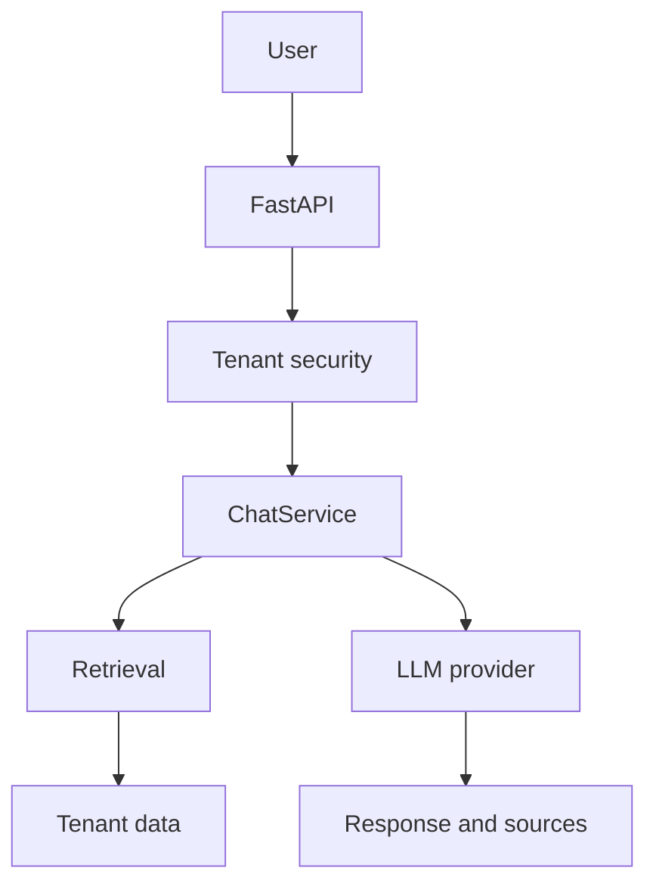

# Avenqo

Avenqo is the modular enterprise AI SaaS platform developed by PMC Solutions AI. Companies activate only the modules they need, while the shared AI Engine handles tenant-isolated data and model workflows.

## Vision

RetailSenseAI is the first native Avenqo module. CRM and accounting contracts are present but are not active products yet.

RetailSenseAI is not a separate platform. Users sign in to Avenqo, activate the `retail` module, and use the shared AI Engine. The former standalone project is not a production dependency of this repository.

## Technology

- FastAPI and SQLAlchemy backend
- Flutter application for web, mobile, and desktop
- Next.js public website and authentication entry points
- Stripe billing integration
- Shared Python AI engine

## Structure of the project

- backend/: application core and service orchestration
- frontend/: application Flutter/Dart unique pour Web, mobile et desktop
- web/: public Next.js website and authentication proxy
- modules/: reusable AI product modules
- shared/: shared AI engine
- payments/: billing and subscription preparation
- docs/: architecture and planning documents
- scripts/: operational helpers
- tests/: validation and quality strategy

## Adding a new AI module

1. Create a new folder under modules/
2. Document its responsibilities and boundaries
3. Keep its contracts isolated from other modules
4. Add its integration points in later implementation phases

## Phase 2 - Authentification Enterprise

The current phase delivers a FastAPI authentication foundation with:
- application factory via create_application()
- centralized settings via pydantic-settings
- request ID middleware
- centralized logging
- centralized error handling
- health endpoint at /api/v1/health
- root endpoint at /
- Argon2 passwords
- short-lived JWT access tokens
- rotating refresh tokens
- email verification and password recovery
- tenant-scoped organizations and employees
- role and permission enforcement

See [docs/authentication.md](docs/authentication.md) and [docs/roadmap.md](docs/roadmap.md).

## Phase 3 - Stripe

The billing layer supports Stripe Checkout, plan changes, end-of-period cancellation, Stripe Customer Portal, signed idempotent webhooks, and tenant-isolated invoice history. See [docs/billing.md](docs/billing.md).

## Client Flutter multiplateforme

Avenqo utilise une seule application Material dans `frontend/`. Les routes et
widgets sont partagés entre Web, Android, iOS, Windows, macOS et Linux.

```powershell
cd frontend
flutter pub get
flutter analyze
flutter test
flutter run -d chrome --dart-define=API_BASE_URL=http://127.0.0.1:8000/api/v1
```

## Running the backend

```powershell
python -m venv .venv
.\.venv\Scripts\Activate.ps1
python -m pip install --upgrade pip
pip install -r backend/requirements.txt
uvicorn backend.main:app --reload
```

## Running tests

```powershell
pytest
```

## Phase 28 - Avenqo AI Chat

`/api/v1/ai/chat` provides tenant-isolated conversations, recent-message memory,
retrieval over authorized tenant resources, source traceability, and SSE streaming.
The provider abstraction supports OpenAI, Anthropic, and Gemini through environment
configuration; provider SDKs remain optional until a provider is selected.



Tenant identity comes only from authenticated server-side context. Conversation,
message, source, and retrieval queries are always scoped by `company_id`; retrieved
documents are explicitly treated as untrusted data and cannot override system rules.

## Local demo account

Create or refresh the verified demo tenant by providing its password through the environment:

```powershell
$env:AVENQO_DEMO_PASSWORD = "<demo-password>"
python -m scripts.seed_demo
Remove-Item Env:AVENQO_DEMO_PASSWORD
```
