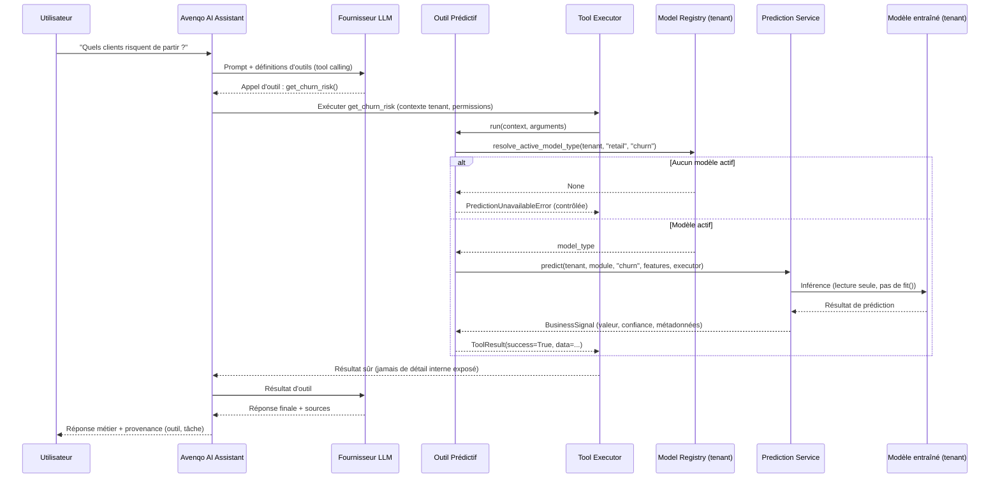

# Avenqo Predictive Intelligence (Phase 31)

## Objectif

Le Business Copilot peut désormais répondre à des questions prédictives
(« quels clients risquent de partir ? », « quelles sont les prévisions de
ventes pour les 2 prochaines semaines ? ») en réutilisant **exactement**
l'infrastructure de tool calling du Phase 30/30.1 et les modèles ML **déjà
entraînés** via le Model Registry. Aucun nouveau moteur d'inférence,
aucune nouvelle boucle d'entraînement : les outils prédictifs ne font
qu'orchestrer des composants existants (`PredictionService`,
`resolve_active_model_type`, les exécuteurs `SklearnPredictionExecutor` /
`ForecastingPredictionExecutor`, et les fonctions `build_*_signal` de
`portfolio_decision_service.py`).

**Règle stricte : jamais de ré-entraînement pendant une conversation.**
Les outils prédictifs ne font que lire le modèle actif déjà entraîné pour
le tenant ; si aucun modèle actif n'existe, l'outil renvoie une réponse
"indisponible" contrôlée — jamais une valeur inventée, jamais un
déclenchement d'entraînement.

## Flux

## Outils prédictifs

| Outil | Capacité requise | Tâche du Model Registry | Description |
| --- | --- | --- | --- |
| `get_churn_risk` | `churn` | `churn` | Nombre de clients à risque de départ |
| `get_segment_insights` | `segmentation` | `segmentation` | Segment de clientèle dominant |
| `get_demand_forecast` | `demand_forecast` | `demand` | Tendance de la demande produit |
| `get_sales_forecast` | `sales_forecast` | `weekly_forecast` | Prévision de ventes (horizon configurable) |
| `get_anomalies` | `anomaly_detection` | `anomaly` | Détection d'anomalies dans les commandes |
| `get_prediction_summary` | — (toujours disponible) | toutes | Liste, sans inférence, les prédictions disponibles pour le tenant |

Chaque outil hérite de `PredictiveAITool` (`backend/app/ai/tools/business/predictive_base.py`),
qui convertit systématiquement `PortfolioAnalysisUnavailable` en
`PredictionUnavailableError` — la seule exception "indisponible" vue par
l'orchestrateur, elle-même une sous-classe de `ToolUnavailableError` déjà
gérée automatiquement par `ToolExecutor`/`ToolOrchestrator` (aucun
branchement supplémentaire nécessaire).

## Isolation tenant et isolation modèle

Aucun outil prédictif n'accepte d'argument `model_id`, `tenant_id` ou
équivalent en provenance du LLM (schémas Pydantic `extra="forbid"`).
L'isolation tenant/modèle est donc **structurelle** : elle provient
exclusivement de `ToolExecutionContext.tenant`, dérivé du JWT côté
`ChatService`, jamais d'une valeur fournie par le modèle de langage. Il
est donc impossible pour un LLM manipulé (prompt injection) de demander
les prédictions d'un autre tenant : `resolve_active_model_type` et
`PredictionService.predict` sont systématiquement scopés par
`tenant.company_id` en base de données.

## Compatibilité des features et fraîcheur des modèles (Phase 31.1)

Les fonctions `build_*_signal` valident déjà la disponibilité des
colonnes nécessaires (via `TargetColumnUnresolved` /
`PortfolioAnalysisUnavailable`) avant toute inférence ; ce cas reste
traduit en `PredictionUnavailableError`. En complément, deux garanties
supplémentaires sont maintenant appliquées par `PredictiveAITool`/
`SklearnPredictionExecutor` :

- **Compatibilité du schéma d'entrée** (`ModelInputIncompatibleError`,
  `backend/app/services/prediction_compatibility.py`) : avant chaque
  inférence sklearn, les colonnes requises sont lues directement dans le
  `ColumnTransformer` déjà entraîné (`pipeline.named_steps["preprocessor"]`)
  — aucune métadonnée n'est inventée ni stockée séparément. Un champ requis
  manquant, ou une colonne numérique non convertible, lève
  `ModelInputIncompatibleError` avant tout appel à `pipeline.predict(...)`.
  Les modèles historiques dont le pipeline n'expose pas d'étape
  `"preprocessor"` (schéma non tabulaire) ignorent simplement ce contrôle :
  limitation documentée, jamais de métadonnée fabriquée pour compenser.
- **Fraîcheur modèle/donnée** (`StalePredictionError`,
  `backend/app/services/prediction_freshness.py`) : réutilise
  `ModelRegistry.created_at` (date d'entraînement du modèle actif) et
  `Dataset.uploaded_at` (dernière donnée importée pour ce module/tenant) —
  aucun nouveau registre. Un modèle est `stale` au-delà de
  `AI_FRESHNESS_STALE_AFTER_DAYS` (défaut : 7 jours) ou si des données plus
  récentes ont été importées depuis l'entraînement, et `expired` au-delà de
  `AI_FRESHNESS_EXPIRED_AFTER_DAYS` (défaut : 30 jours). Ces seuils sont des
  **défauts techniques configurables**, pas un engagement commercial. Par
  défaut (`AI_FRESHNESS_BLOCK_ON_EXPIRED=true`), un modèle `expired` refuse
  l'inférence via `StalePredictionError` sans jamais l'exécuter ; un statut
  `stale` n'est pas bloquant mais est systématiquement renvoyé dans
  `ToolResult.data["freshness"]` (`{"status", "data_as_of",
  "model_trained_at"}` — jamais de chemin de stockage ni d'identifiant de
  modèle). Un statut `unknown` (aucune ligne `ModelRegistry`, ex. anciens
  tenants) ne bloque jamais rien : documenté comme comportement sûr par
  défaut. `get_prediction_summary` ne réalisant aucune inférence, il
  n'évalue pas la fraîcheur (`evaluate_freshness_flag = False`).

## Aucune donnée inventée

En l'absence de modèle actif ou de prédiction exploitable, les outils
prédictifs ne renvoient **jamais** de valeur par défaut ou simulée : ils
lèvent `PredictionUnavailableError`, que l'orchestrateur convertit en
`ToolResult(success=False, error=...)` sûr, sans détail de fournisseur ni
de modèle.

## Limites connues

- Le contrôle de compatibilité de schéma ne couvre que les colonnes
  requises manquantes et un contrôle de type numérique basique ; il ne
  valide pas des contraintes de valeur plus fines (plages, catégories
  inconnues au moment de l'entraînement au-delà de `handle_unknown`).
- Les modèles dont le pipeline sklearn n'expose pas d'étape
  `"preprocessor"` (schéma non tabulaire) ne bénéficient pas du contrôle de
  compatibilité — limitation assumée plutôt que de fabriquer une métadonnée.
- Les seuils de fraîcheur par défaut (7 / 30 jours) sont techniques, pas
  contractuels ; ils doivent être ajustés par variable d'environnement si
  une politique commerciale différente est requise.

