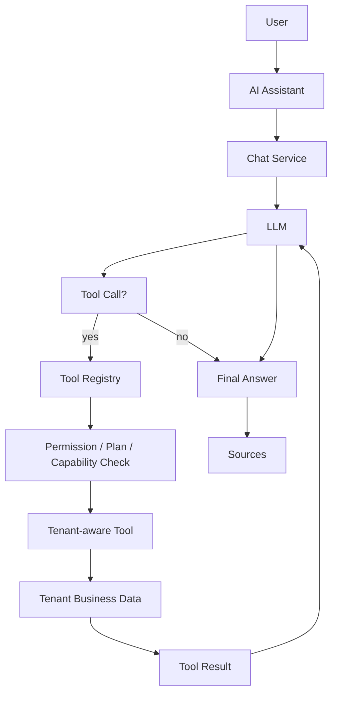

# Avenqo AI Tool Calling Architecture (Phase 30)

## Overview

Phase 30 turns the Phase 28 AI Chat Engine into a **read-only Business
Copilot**: the LLM can decide it needs real tenant business data, call an
authorized Avenqo tool, and turn the structured result into a business
answer. No autonomous/mutable actions exist yet — every tool is read-only.

## Tool Registry & Execution Context

- `backend/app/ai/tools/base.py` — `AITool` contract: `name`, `description`,
  `input_schema`/`output_schema` (Pydantic, `extra="forbid"`),
  `required_permissions`, `read_only`, `timeout_seconds`, `minimum_plan`,
  `requires_capability`.
- `backend/app/ai/tools/contracts.py` — `ToolExecutionContext` (tenant,
  user_id, permissions, request_id — **always built by the authenticated
  backend, never from LLM output**), `ToolResult`, `ToolDefinition`,
  `ToolCall`, `ToolCallResult`.
- `backend/app/ai/tools/registry.py` — `ToolRegistry.available_for(...)`
  filters by permission subset, plan rank (`backend/app/ai/tools/plans.py`),
  and tenant capability — never exposes every tool to every user.
- `backend/app/ai/tools/executor.py` — `ToolExecutor` validates arguments
  (Pydantic, rejects unknown/invalid), checks permissions, enforces a
  per-tool timeout, truncates oversized results
  (`MAX_TOOL_RESULT_CHARS`), and logs structured, non-sensitive
  observability data (`tool_name`, `duration_ms`, `success`, `tenant_id`,
  `request_id` — never raw arguments or data).

## Security invariants

- `tenant_id`, `user_id`, and `permissions` in `ToolExecutionContext` come
  exclusively from `CurrentIdentity`/`TenantContext` (JWT-derived), set by
  `backend/app/routers/ai_chat.py`. The LLM cannot influence them.
- Tools never execute raw SQL: they call `CompanyDatasetIngestionService`
  (Phase 26/27) and existing analytics services only.
- Cross-tenant access is inherited from `CompanyDatasetIngestionService`
  and dataset queries scoped by `company_id` — verified in
  `tests/backend/test_phase30_tool_calling.py`.

## Business tools (read-only)

| Tool | Data source | Status |
|---|---|---|
| `get_business_overview` | `PreparedCompanyDataset` (Phase 26/27) | Real data |
| `get_sales_summary` | idem | Real data (location/category filters flagged unsupported: no canonical field yet) |
| `get_sales_trend` | idem | Real data |
| `get_sales_comparison` | idem | Real data |
| `get_top_products` | idem | Real data |
| `get_customer_summary` | idem | Real data |
| `get_customer_segments` | existing trained segmentation model via `PredictionService` | Real data, no retraining |
| `get_inventory_summary` | — | **Prepared but unavailable**: no inventory data model exists in the platform yet |

All sales/customer aggregations are computed in
`backend/app/ai/tools/business/analytics.py` directly from
`PreparedCompanyDataset` rows using the canonical field mapping — no
fabricated numbers, no new file reads outside the existing pipeline.

## Provider Adapters

`backend/app/ai/llm/base.py` adds an optional `generate_with_tools()` (default:
raises `ToolCallingUnsupportedError`, causing the orchestrator to fall back
to plain generation). Implemented for OpenAI (native `tools`/function
calling), Anthropic (`tool_use`/`tool_result` blocks) and Gemini
(`function_declarations`/`function_call`). Internal representation
(`ToolDefinition`, `ToolCall`, `LLMMessage`, `LLMToolResponse`) stays
provider-agnostic; each provider converts to/from its own format.

## Orchestration loop

`backend/app/ai/chat/orchestrator.py` — `ToolOrchestrator.run(...)` bounds
the LLM ↔ tool loop with `MAX_TOOL_ITERATIONS` (default 5) and
`MAX_TOOLS_PER_REQUEST` (default 8), both configurable via `Settings`
(`AI_MAX_TOOL_ITERATIONS`, `AI_MAX_TOOLS_PER_REQUEST`,
`AI_MAX_TOOL_RESULT_CHARS`). It never loops infinitely and always falls
back to a plain answer if the provider doesn't support tool calling or no
tools are available for the tenant/user.

`ToolOrchestrator.run_streaming(...)` (Phase 30.1) drives the exact same
loop but yields `OrchestrationEvent`s (`status` before each tool-execution
round, then a final `OrchestrationResult`) instead of only returning at the
end — `run()` is now implemented as a thin wrapper over `run_streaming()`,
so there is a single tool-calling implementation for both `send()` and
`stream()`.

## SSE streaming (Phase 30.1)

`ChatService.stream(...)` now accepts the same `permissions`/`plan_code`/
`capabilities`/`request_id` kwargs as `send()`, plus an `is_cancelled`
async callable. It yields `ChatStreamEvent(kind, payload)` with
`kind` in `status` / `delta` / `sources` / `done` / `error`:

- `status`: a generic message only (e.g. "Analyzing your business data...").
  Never contains a tool name, arguments, SQL, provider name, or tenant id.
- `delta`: `{"chunk": "..."}` — real provider tokens when no tool is
  invoked, or the final tool-calling answer chunked into fixed-size pieces.
- `sources`: `{"sources": [...]}` — tool/RAG source references, emitted
  once, right before `done`.
- `done`: end-of-stream marker.
- `error`: `{"detail": "..."}` — safe, generic message only.

`backend/app/routers/ai_chat.py`'s `/messages/stream` endpoint now
resolves permissions/plan/capabilities like `/messages` does, and passes
`http_request.is_disconnected` as `is_cancelled` so a client disconnect
(Stop Generating) stops the orchestration/tool loop and skips persistence
— `ChatService.stream()` never persists when cancelled or when the final
content is empty, preserving exactly-once persistence.

## ChatService integration

`ChatService.send(...)` gained optional keyword arguments
(`permissions`, `plan_code`, `capabilities`, `request_id`) — when omitted
(existing call sites), behavior is 100% backward compatible (no tools
used, exact Phase 28 behavior). `backend/app/routers/ai_chat.py` now
resolves the caller's real permissions (RBAC), plan, and tenant
capabilities and passes them in. Tool-derived dataset references are
persisted as message sources alongside RAG sources.

## Tool lifecycle

1. Router resolves `TenantContext`, `CurrentIdentity`, permissions, plan,
   capabilities — all backend-authenticated, never client-supplied.
2. `ChatService.send()` builds a `ToolExecutionContext` and resolves
   `ToolRegistry.available_for(...)`.
3. `ToolOrchestrator` calls the provider; if it requests a tool, the
   `ToolExecutor` validates arguments, checks permissions, runs with a
   timeout, and returns a `ToolResult`.
4. The result is truncated if oversized, fed back to the LLM, and the
   loop continues until a final answer or the iteration limit.
5. The final answer and tool-derived sources are persisted via
   `ConversationService`.

## Known limitations (see final report for the full list)

- The orchestrator's multi-turn message thread is a simplified,
  provider-agnostic representation; it has not been validated against the
  real OpenAI/Anthropic/Gemini APIs with live credentials (mocked in
  tests).
- `get_inventory_summary` is a prepared contract only; it always returns
  "unavailable" until real inventory data exists.
- Phase 30.1: after a tool-calling round, the final answer is not
  token-streamed live from the provider (the orchestrator's `generate_with_tools`
  call already returns full text once tool calls are resolved); it is
  chunked server-side into small `delta` events to preserve a streaming UX.
  Real token streaming is only used when no tools are invoked for the turn.
